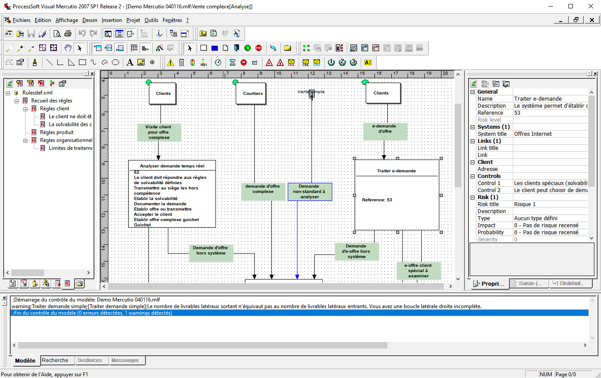

# Visual Mercutio
This repository contains the full source code of the process management solution **Visual Mercutio**, originally developed by ProcessSoft. This code source is published with the kind permission of Mr. Eric Bouchez.

The source code is provided under the terms of the MIT License. Please find the complete product documentation in the Documents directory.

## Prerequisites
To compile the source code, several third party libraries are required. Some of them can be found in the Third Party directory.

Here is the list of required libraries:
- **Stingray Studio**. This library isn't open source, for that reason it cannot be found in the Third Party directory. Please contact the developer website to get a copy: https://www.roguewave.com/products-services/stingray/components-demos
- **CJ60Lib**. The CodeJockeys library is an extended component set for MFC applications. This library is no longer developed, but you can find the source code in the Third Party directory.
- **easysoap++**. The easysoap+ + is a c++ library for SOAP (Simple Object Access Protocol). The project seems no longer active since 2006, however a working copy may be found in the Third Party directory. Further info about this project may be found here: http://easysoap.sourceforge.net
- **expat**. Expat is a c library for parsing XML. A submodule to the official project may be found in the Third PArty directory. Further info about this project may be found here: https://libexpat.github.io/

##Compilation

##Future

##Common issues
BE CAREFUL the paper size visible on the application depends directly on the selected paper size of your default printer. Since the latest Windows 10 updates, there is an option to let the printer manager to automatically select you default printer. This may cause previously created models to be shown on a page with an incorrect size, which may crop a part of your model. If this situation happens, please disable the "Let Windows manage my default printer" option in the "Printers & Scanners" tab, and select your correct default printer, which contain the expected paper size manually.
